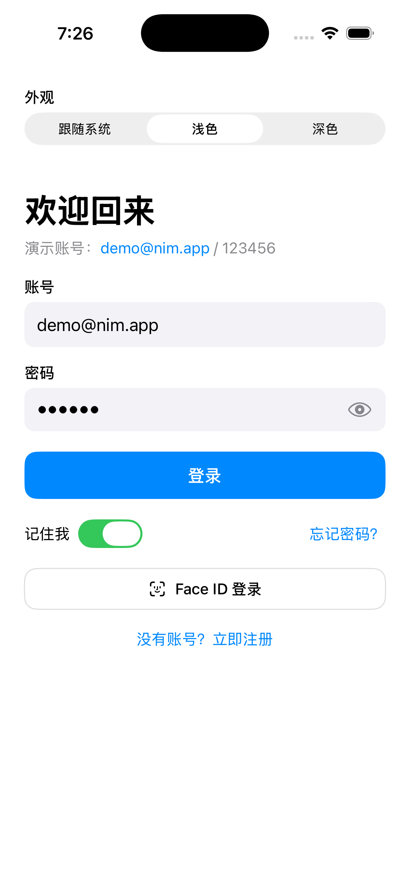
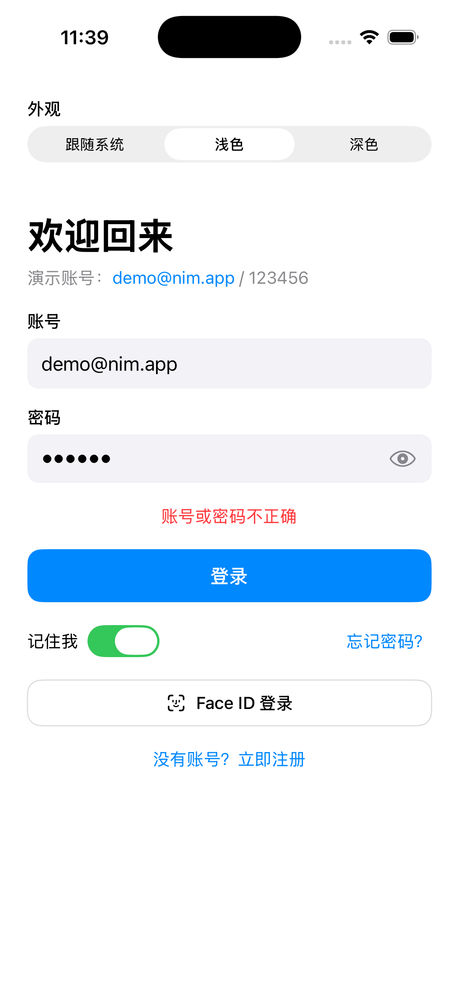
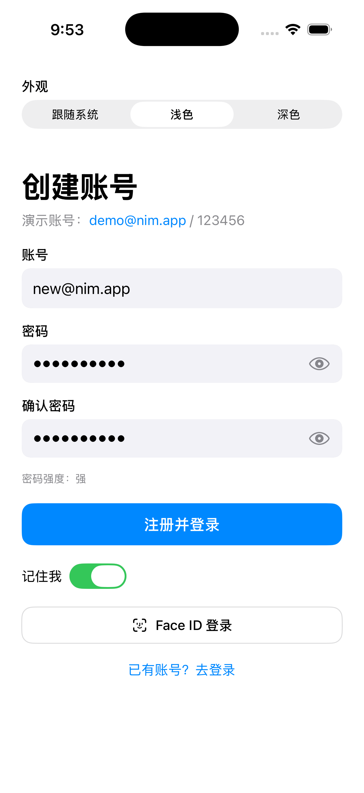
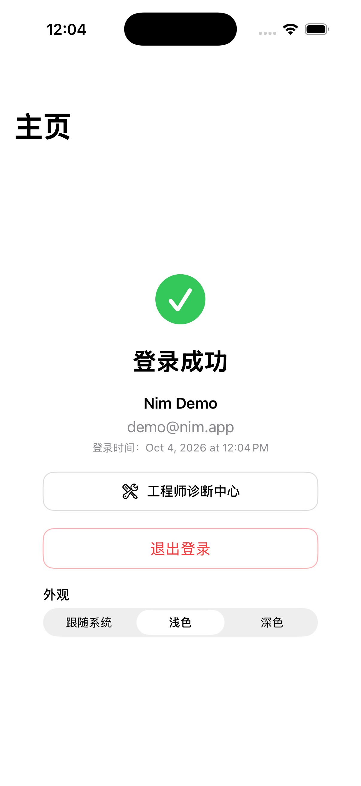
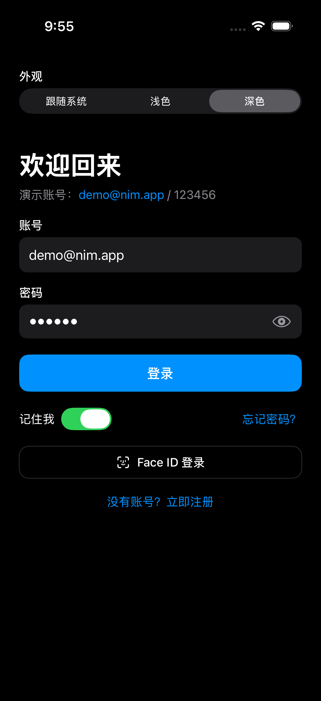
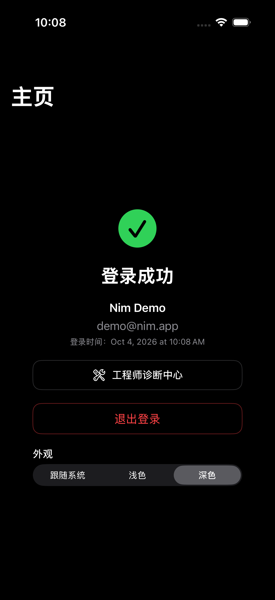
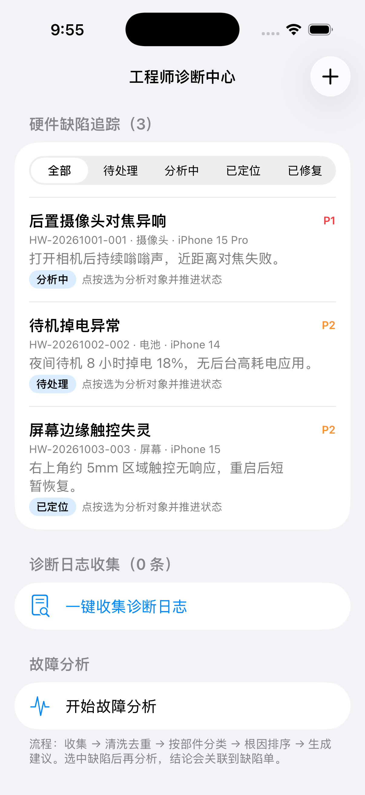
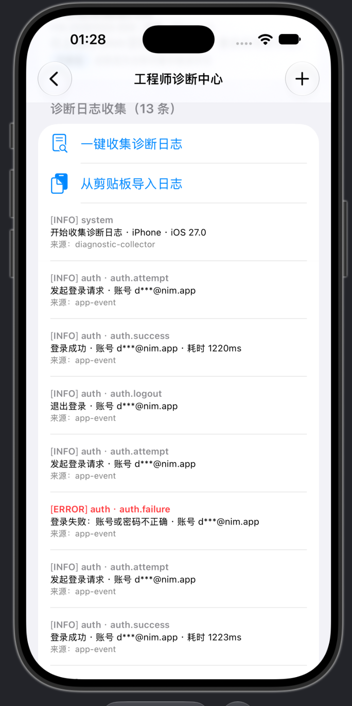
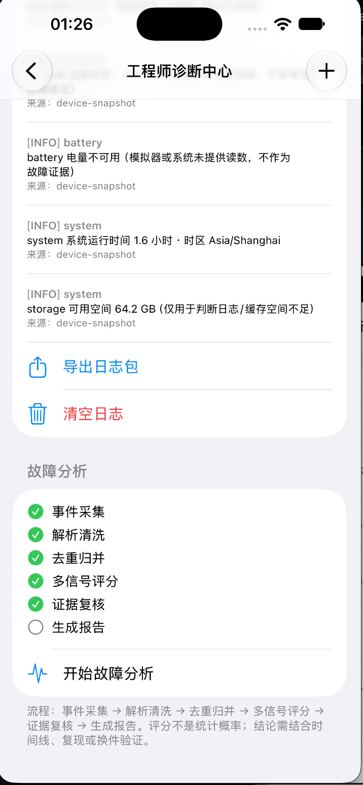
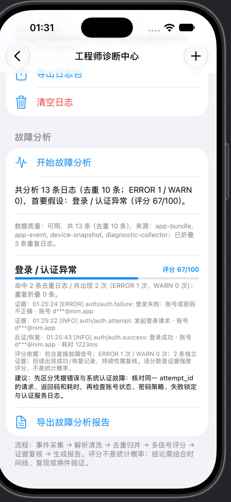

# ios-nim-loginApp

一个用 **Swift + SwiftUI** 写的 iOS 登录交互逻辑示例 App，重点不在 UI 花哨，而在把登录这条链路做完整：

输入校验 → 状态管理 → 模拟网络请求 → 成功/失败处理 → 登录态保持 → 退出登录。

## Demo 演示

| 登录 | 登录失败 | 注册 | 登录成功 |
| --- | --- | --- | --- |
|  |  |  |  |

| 登录（深色） | 主页（深色） | 工程师诊断中心 |
| --- | --- | --- |
|  |  |  |

演示账号：`demo@nim.app` / `123456`，故意输错密码即可看到失败提示。以上截图由 GitHub Actions 的云端 macOS 模拟器真实运行生成。

📹 **完整故障分析演示视频**：[docs/videos/fault-analysis-flow.mp4](docs/videos/fault-analysis-flow.mp4)（云端模拟器录屏：登录事件采集 → 设备快照 → 故障分析 → 证据化结论）

📹 **完整 App 流程视频（真实点击）**：[docs/videos/full-app-flow.mp4](docs/videos/full-app-flow.mp4)（从启动登录页开始：输错密码 → 登录失败被记录 → 正确密码登录 → 工程师诊断中心 → 收集真实事件与设备快照 → 故障分析 → 导出结论，由 UI 测试在云端模拟器真实点击录制）

## 功能

- 账号输入：支持邮箱 / 手机号，自动判断类型并校验格式
- 密码输入：显示/隐藏切换、长度校验、注册时密码强度提示
- 实时校验：输入时提示错误，错误信息贴在输入框下方，不弹窗打断
- 登录按钮状态：`不可点（未填完）→ 可点 → 加载中（转圈、防重复点击）→ 成功/失败`
- 模拟登录接口：`MockAuthService` 延迟 1.2 秒模拟网络
  - 演示账号：`demo@nim.app` / `123456`
  - 密码不对会返回明确错误；演示账号以外、格式正确的账号也可登录成功（方便体验流程）
- 注册模式：登录/注册切换，含确认密码一致性校验
- 记住我：勾选后下次自动填充账号
- 登录态保持：登录成功后保存 mock token，杀掉 App 重开仍是登录状态
- 主页：显示当前用户、登录时间，支持退出登录
- 忘记密码：底部弹层，校验邮箱后提示已发送重置邮件（模拟）
- Face ID 按钮：入口和交互占位，点击会提示演示模式未启用生物识别
- **外观 / Dark Mode**：登录页和主页都有「外观」切换，支持 `跟随系统 / 浅色 / 深色` 三档，选择会持久化保存；深色下输入框、背景、文字自动适配系统语义色
- **工程师诊断中心**（登录后从主页进入）：
  - 硬件缺陷追踪：按状态筛选（待处理/分析中/已定位/已修复）、新建缺陷（部件/严重程度 P0-P3/设备型号/现象）、点按推进状态、滑动删除，本地持久化
  - 真实事件采集：登录/注册的尝试、失败（带错误码）、成功（带耗时）和退出都会写入结构化事件日志；密码不会入日志，账号在消息中脱敏，并用同一个 `attempt_id` 串起一次请求
  - 设备快照：收集 App 版本、系统版本、热状态、电池读数、低电量模式、系统运行时间和可用空间等当前设备上下文（模拟器没有的读数会明确标为不可用，不伪造）
  - 外部日志导入：可从剪贴板导入工程师手里的服务/设备日志文本，解析常见的时间戳、级别、分类和消息格式
  - 证据化故障分析：`事件采集 → 解析清洗 → 去重归并 → 多信号评分 → 证据复核 → 生成报告`，输出排序后的根因假设、原始证据引用、反证/恢复证据、评分依据和下一步建议，并可导出 Markdown incident 报告

## 真故障分析怎么做

详细设计、评分表和验证场景见 [docs/fault-analysis.md](docs/fault-analysis.md)。

这不是把几条模拟日志套关键词打个百分比。分析链路按真实排障的方式组织：

1. **先有真数据**：App 只把自己能合法观察到的数据当证据——结构化登录事件和即时设备快照。摄像头 OIS、电池老化这类 App 测不到的结论，必须来自工程师导入的外部日志，App 不再编造部件探针错误。
2. **解析与去重**：导入日志会解析时间戳、级别（INFO/WARN/ERROR）、分类和消息；相同故障的重复行会折叠计数，重复次数作为复发证据，而不是把同一行算成很多条独立证据。
3. **良性过滤**：只有提到部件、但内容是「健康度良好 / 扫描完成 / 初始化成功」的正常状态行不会生成故障假设。
4. **多信号评分**：每个假设按直接故障信号、ERROR/WARN 级别、独立证据条数、重复频率、是否与所选缺陷部件一致、以及后续是否出现成功/恢复记录综合评分（0-100）。失败后很快成功登录会降低「持续故障」的分数，但事件本身仍会被记录和分析。
5. **证据可审计**：每个假设都引用原始日志行，报告包含关键时间线、数据范围和限制，导出的 Markdown 报告可以直接贴进缺陷单或 incident 记录。

### 评分口径与边界

- 界面里的「评分」是**证据强度评分，不是统计概率**。单个明确的 ERROR 会得到中等分数，多条独立证据和未恢复的重复故障才会把分数推高。
- iOS 沙箱内不能读取系统级 sysdiagnose、其他 App 的日志或服务端日志；未接入这些来源时，结论只能叫「首要假设」，不能宣称整机根因已证实。
- 当前认证仍是 `MockAuthService` 演示实现；真实接口接入后，同一套 `attempt_id`、错误码和耗时字段可以对齐服务端日志继续用。
- 事件日志只保存在本机（最多 100 条），不上报服务器；日志消息不包含密码，账号只以脱敏形式出现。
- 一条日志可能同时支持多个假设（例如「摄像头过热导致对焦失败」），最终确认仍需要复现实验或换件验证。

### 已覆盖的验证场景

单测覆盖了：登录失败被抓取并引用证据、良性部件状态不误报、重复失败折叠计数且分数上升、认证与摄像头混合故障各自保留假设、导入的网络超时/503 日志命中网络异常、日志文本解析和 incident 报告生成。

### 本地运行验证记录（2026-10-05）

用户在本地 Xcode 运行后进入「工程师诊断中心」，按「一键收集诊断日志 → 开始故障分析」完成了一次真实操作验证：

| 步骤 1：收集诊断日志 | 步骤 2：开始故障分析 | 步骤 3：查看证据化报告 |
| --- | --- | --- |
|  |  |  |

本次截图里的结果：

- 收集到 **13 条诊断日志**，来源包括 `app-event`、`device-snapshot`、`app-bundle`、`diagnostic-collector`。
- 日志中能看到真实登录链路：`auth.attempt`、一次 `[ERROR] auth.failure`（登录失败：账号或密码不正确）、随后 `auth.success`（耗时 1223ms），账号均已脱敏为 `d***@nim.app`。
- 点击「开始故障分析」后，系统输出：共分析 13 条日志（去重 10 条；ERROR 1 / WARN 0），首要假设为 **登录 / 认证异常（评分 67/100）**。
- 报告引用了原始证据和反证：证据为 `01:25:24 [ERROR] auth/auth.failure` 与 `01:25:22 [INFO] auth/auth.attempt`；反证/恢复为 `01:25:43 [INFO] auth/auth.success`。这说明它识别到这是一次已恢复的凭据失败，而不是直接宣称持续性的认证系统故障。
- 报告建议继续核对同一 `attempt_id` 的请求、返回码和耗时，再检查账号状态、密码策略、失败锁定与认证服务日志。

## 技术结构（MVVM）

```
NimLoginApp/
├── NimLoginAppApp.swift        // App 入口
├── ContentView.swift           // 根据登录态切换 登录页 / 主页
├── Models/
│   ├── User.swift              // User、AuthSession
│   └── Diagnostics.swift       // 硬件缺陷、诊断日志、故障分析模型
├── Services/
│   ├── AuthService.swift       // AuthService 协议 + Mock 实现，真接口替换这里即可
│   ├── AppEventLog.swift       // 结构化事件日志：attempt_id / error_code / duration_ms
│   ├── DiagnosticLogParser.swift // 外部日志文本解析（时间戳/级别/分类/消息）
│   └── FaultAnalyzer.swift     // 证据加权故障分析 + Markdown incident 报告生成
├── ViewModels/
│   ├── AuthViewModel.swift     // 登录交互逻辑核心：校验、状态、异步登录
│   └── DiagnosticsViewModel.swift // 缺陷追踪、日志收集、分析状态
├── Views/
│   ├── LoginView.swift         // 登录/注册页
│   ├── HomeView.swift          // 登录成功后的主页
│   ├── DiagnosticsView.swift   // 工程师诊断中心
│   └── Components/
│       ├── InputField.swift    // 带错误提示的输入框组件
│       └── PrimaryButton.swift // 带 loading 状态的主按钮
└── Utils/
    ├── Validators.swift        // 邮箱/手机号/密码校验，可单测
    └── AppTheme.swift          // 外观主题：跟随系统/浅色/深色，持久化 + ThemePicker
NimLoginAppTests/
├── ValidatorsTests.swift
├── AuthViewModelTests.swift
├── AppThemeTests.swift
└── FaultAnalyzerTests.swift
```

把 `MockAuthService` 换成真实接口时，只需要实现 `AuthService` 协议（`login` / `register`），`ViewModel` 和 `View` 不用改。

## 运行

1. 用 Xcode 15+ 打开 `NimLoginApp.xcodeproj`
2. 选 iPhone 模拟器，直接 Run
3. 用演示账号登录：`demo@nim.app` / `123456`
   - 故意输错密码可以看到失败状态和错误提示

最低系统：iOS 17.0

## 测试

Xcode 里按 `Cmd + U` 运行单测，覆盖了校验规则、登录成功/失败/重复提交、结构化事件落盘（且不含密码）、良性日志不误报、重复故障折叠计数、混合故障、外部日志解析与 incident 报告生成等核心逻辑。
